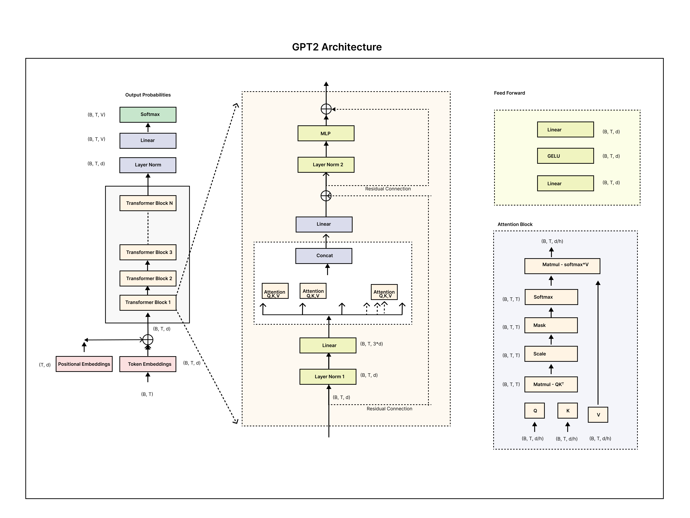

# GPT-2 - Training and Inference

This repository is building a GPT-2 model from scratch, coding the  architecture and providing separate modules for both inference and training. 

## Overview
GPT-2 implementation its architecture, training it on external data, and visualizing its attention mechanisms on layer and head. The repository includes separate modules for inference and training of gpt2.

## Features

### Building GPT-2 Architecture
- **From Scratch Implementation**: The GPT-2 architecture, including its essential components such as attention mechanisms, layer normalization, and positional embeddings, is built from scratch.
- **Drawing Inspiration**: The implementation closely parallels the Hugging Face Transformer library to ensure compatibility and best practices.

### Inference Module
- **Custom Inference Module**: A fully functional inference module has been developed from the ground up.
- **Parameter Loading**: 124 million parameters are loaded from the Hugging Face library to ensure compatibility with standard GPT-2 configurations.
- **Comparison Analysis**: The custom-built GPT-2 model’s inference results are compared against the Hugging Face GPT-2 model.

#### Key Insights:
1. **Result Parity**: The outputs from the custom GPT-2 model match those of the Hugging Face GPT-2 model.
2. **Pipeline Discrepancy**: While the underlying models produce similar results, text generated using the Hugging Face pipeline differs due to additional preprocessing and sampling strategies.

### Training Module
- **External Data Integration**: External datasets are loaded and preprocessed to train the custom GPT-2 architecture effectively.
- **Custom Training Loop**: A training loop is implemented to fine-tune the model and evaluate performance iteratively.

### Attention Visualization Module
- **Understanding Attention**: A dedicated module visualizes attention mechanisms for better interpretability of the model.
- **Token Mapping**: This module highlights which tokens in the input sequence attend to others, providing insights into how the model processes information.

## Model Architecture
The GPT-2 model is designed using the following parameters:

- **`vocab_size`**: 50257
  - Size of the vocabulary, representing all possible tokens.
- **`n_embed`**: 768
  - Dimensionality of token embeddings and hidden states.
- **`block_size`**: 1024
  - Maximum context length for processing sequences.
- **`n_blocks`**: 12
  - Number of transformer blocks in the architecture.
- **`n_heads`**: 12
  - Number of attention heads in each block.

## How to Use This Repository

1. **Inference**:
   - Load the pre-trained parameters using the provided scripts.
   - Use the inference module to generate text based on input prompts.

2. **Training**:
   - Prepare external datasets for fine-tuning the architecture.
   - Run the training scripts to update model weights.

3. **Attention Visualization**:
   - Use the visualization module to analyze token attention for input examples.

